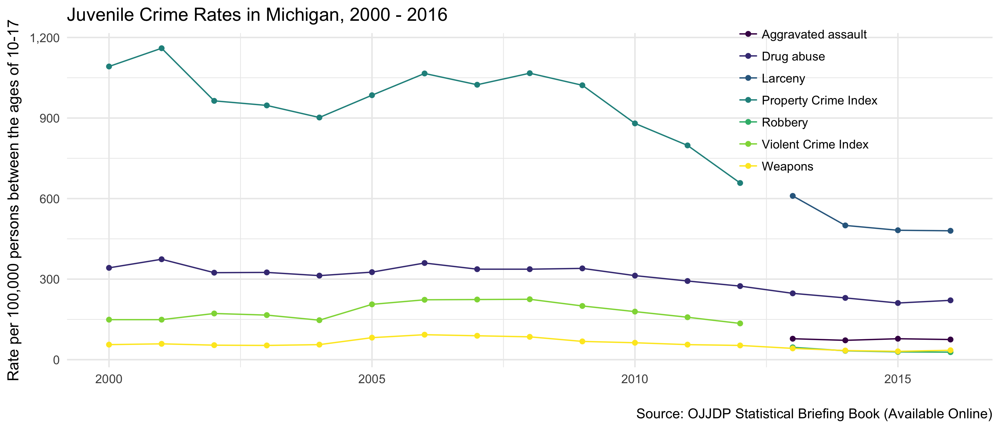

# ojjdp-public-jj-crime-rates
### Graphing OJJDP reported arrest rates for juveniles in the US from 2000-2016

This repository contains code used to collect and plot data from the OJJDP's Statistical Briefing Book. The data reflect rates of *juvenile arrests* between 2000 and 2016 for different offense types and indexes. An example table can be found [here.](https://www.ojjdp.gov/ojstatbb/crime/qa05103.asp?qaDate=2000)

